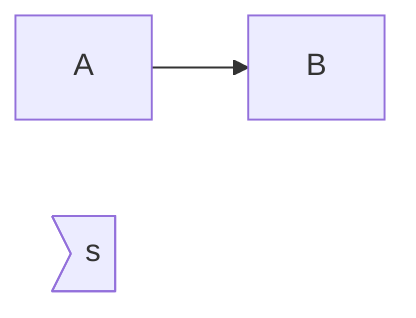

# 粗斜体

斜体： *advance*

粗体： **_advance**

粗斜体：___advance___

一个：斜体

两个：粗体

三个：粗斜体


# 分割线

*

-

_

# 删除线

~~You~~ 

# 下划线

`<u>`

<u>You</u>

# 脚注

你[^ You]

[^ You]:还好吗？

# 列表

无序：星号 加减号  * - +

有序 点：[[num].]

镶嵌 tab 四个空格

# 区块

&& 镶嵌 :

`>`

> 就是这样
>
> > > 镶嵌

列表镶嵌：

> + A
>   1. 这样
>   2. 那样
>   3. 结果
> + B

# 代码

` ``` `包裹一段代码 并标明语言

或者在 

``` markdown 
`str`
```

# 链接

名称 地址 

地址是：[Hello](fit-yourself.github.io)

或为变量~~

URL :[Baidu][ Baidu]

[Baidu]:https://www.baidu.com/

# 图片

![我叫][img]

[img]:lion-savage.jpg

或用HTML 标签：


# 表格

`|`  

`-` 分割表头和其他行

| 星期一 | 星期二 |
| :----- | ------ |
|        |        |

对齐方式：往那边对齐，那边加`:`

# 支持的Html元素

<kbd>  键盘文本

<kbd>ctrl</kbd>

`ctrl`

## 公式


$$

$$

# 流程图

流程图方向有下面几个值

- TB 从上到下
- BT 从下到上
- RL 从右到左
- LR 从左到右
- TD 同TB

B：bottom

